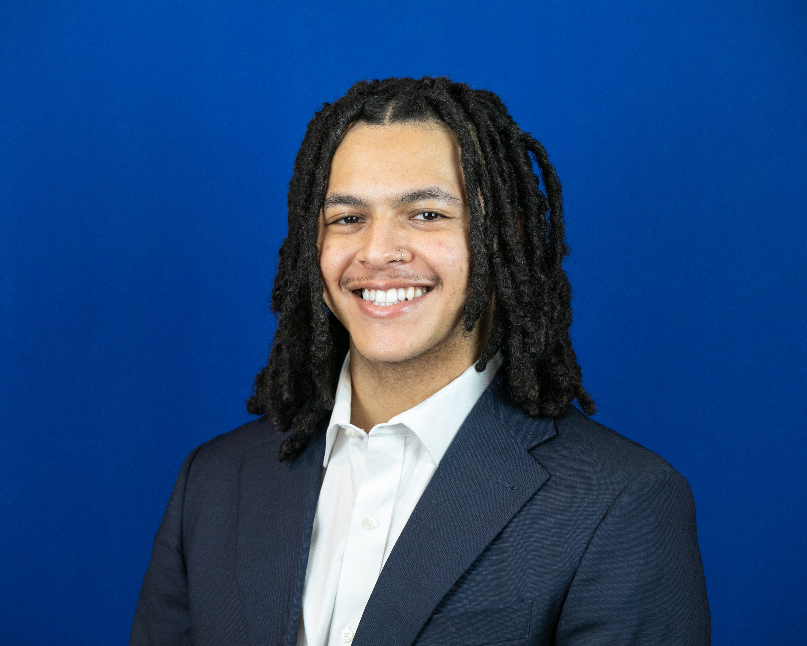

## Zakari L. Billo

I’m a MPHc '26 and a Tow Doctoral Scholar at the Epidemiology Department in the Columbia Mailman School of Public Health. Currently, I'm applying to Biostatistics PhD programs. 

My research lies at the intersection of Biostatistics and Epidemiology: developing causal inference methods for structure learning and algorithmic fairness. Specific areas of interest are in aging and bias in social policy. I do research under the supervision of Prof. [Daniel Malinsky](https://www.dmalinsky.com/).

Before that, I received a BS in Chemistry from the University of North Carolina at Chapel Hill.

